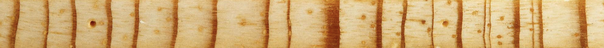

# Contact
In the case of any questions or requests for previously published papers as PDFs, please use one of the following ways to get in touch with me:

1. Email is the most reliable way to reach me (mtorbens(at)tamu.edu).
2. [ResearchGate](https://www.researchgate.net/profile/Max-Torbenson).
3. My office (706C) is located in the Eller Oceanography and Meteorology building on the Texas A&M University campus, College Station.
4. Office phone:

I am currently not accepting graduate students for 2026, but please look out for announcements in the future.

  

