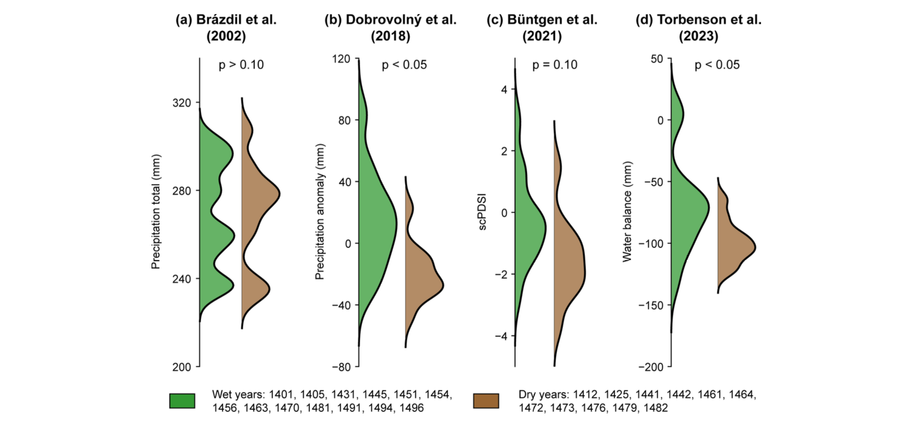
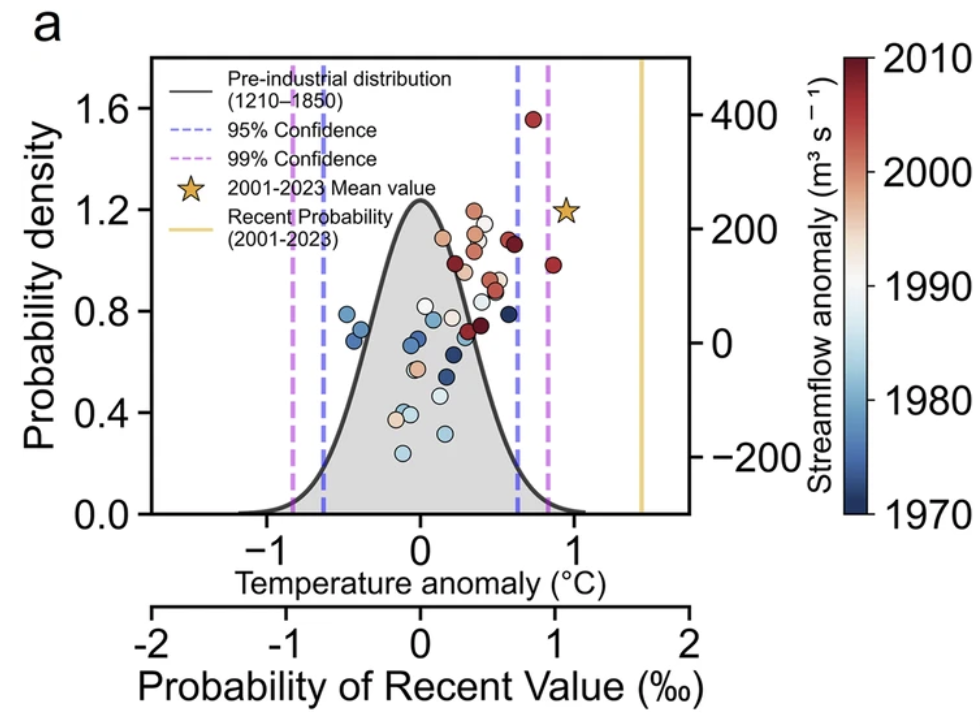
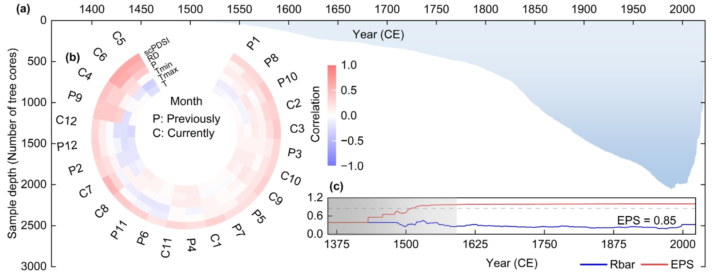
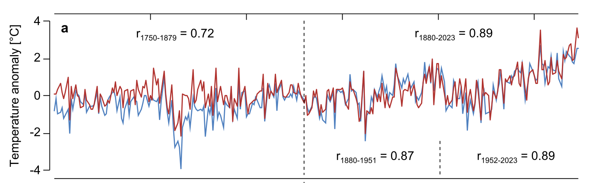
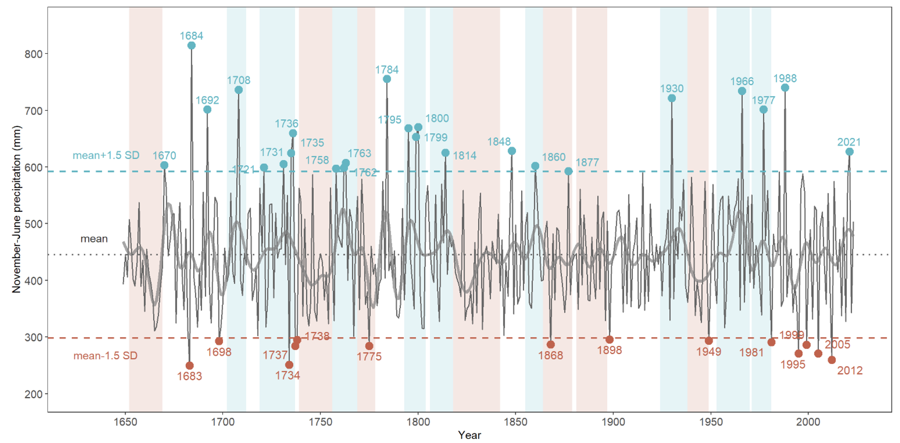

# News
### January 12th, 2026: Paper published

> Professor Rudolf Brázdil's (Masaryk University) paper entitled **"15th century climate in the Czech Lands and its Central European context"** has been published in the journal *Climate of the Past* and can be found [here](https://cp.copernicus.org/articles/22/49/2026/).

### January 9th, 2026: Paper published

> A paper lead by Dr. Youping Chen (Yunnan University), entitled **"Unprecedented recent summer warming and cross-sphere hydrological coupling in Asian Water Towers"**, is now published with *npj Climate and Atmospheric Science* (accessible [here](https://www.nature.com/articles/s41612-025-01254-y)).

### January 3rd, 2026: Paper published

> A paper lead by Weipeng Yue and Professor Feng Chen (Yunnan University), entitled **"Runoff Reconstructions and Future Projections Indicate Highly Variable Water Supply From Pacific Rim Water Towers"**, is now published with *AGU Advances* (accessible [here](https://agupubs.onlinelibrary.wiley.com/doi/10.1029/2025AV002053)).

### November 20th, 2025: Paper published

> A paper lead by Shijie Wang and Professor Feng Chen (Yunnan University), entitled **"Recent south-central Andes water crisis driven by Antarctic amplification is unprecedented over the last eight centuries"**, is now published with *Communications Earth & Environment* (accessible [here](https://www.nature.com/articles/s43247-025-02858-1/)).

### October 13th, 2025: Paper published

> **"Pan-alpine summer temperatures since 742 CE"** by Professor Jan Esper (JGU Mainz) and others has been [published](https://www.sciencedirect.com/science/article/pii/S1125786525001468) in *Dendrochronologia*.

### October 13th, 2025: Pre-print available

> A pre-print entitled **"Unlocking the potential of pollarded oaks: A 375–year hydroclimate reconstruction from northcentral Spain"** lead by Dr. Alba Sanmiguel-Vallelado (Universidad de Valladolid) has been posted on EGUsphere, and can be accessed [here](https://egusphere.copernicus.org/preprints/2025/egusphere-2025-4494).

  

