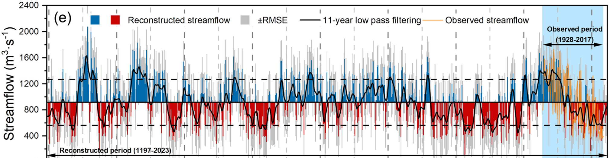

# News
### November 20th, 2025: Paper published

> A paper lead by Shijie Wang and Professor Feng Chen (Yunnan University), entitled **"Recent south-central Andes water crisis driven by Antarctic amplification is unprecedented over the last eight centuries"**, is now published with *Communications Earth & Environment* (accessible [here](https://www.nature.com/articles/s43247-025-02858-1/)).

### October 13th, 2025: Paper published
> **"Pan-alpine summer temperatures since 742 CE"** by Professor Jan Esper (JGU Mainz) and others has been [published](https://www.sciencedirect.com/science/article/pii/S1125786525001468) in *Dendrochronologia*.

### October 13th, 2025: Pre-print available
> A pre-print entitled **"Unlocking the potential of pollarded oaks: A 375–year hydroclimate reconstruction from northcentral Spain"** lead by Dr. Alba Sanmiguel-Vallelado (Universidad de Valladolid) has been posted on EGUsphere, and can be accessed [here](https://egusphere.copernicus.org/preprints/2025/egusphere-2025-4494).

### September 22nd, 2025: Paper published
> Inga Homfeld's (JGU Mainz) paper entitled **"Beyond maximum density: multi-parameter insights into Scots pine climate sensitivity"** has been published in the journal *Trees* and is available [here](https://link.springer.com/article/10.1007/s00468-025-02681-3).

