# News
### June 13th, 2026: Manuscript accepted for publication
<a href="../assets/temp/albaP1.png" class="lightbox">
    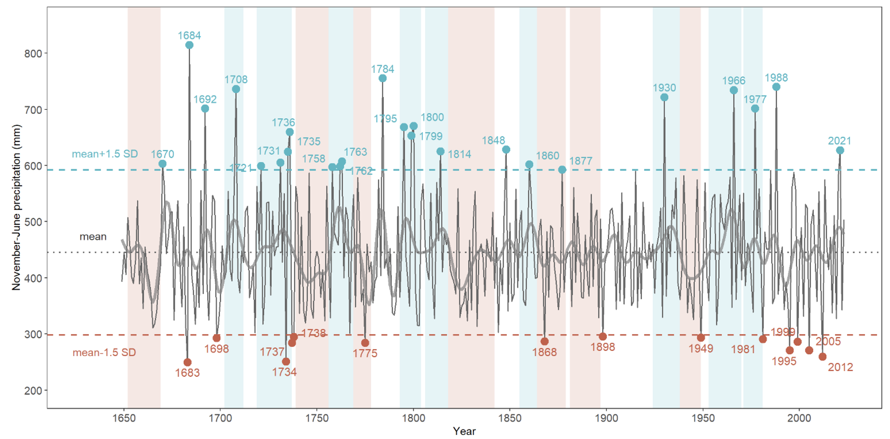
</a>

> Dr. Alba Sanmiguel-Vallelado's (Universidad de Valladolid) manuscript **"Unlocking the potential of pollarded oaks: A 375–year hydroclimate reconstruction from northcentral Spain"** has, after open peer review, been accepted for publication in *Biogeosciences*. The paper and information on the review process is available [here](https://egusphere.copernicus.org/preprints/2025/egusphere-2025-4494).

### June 13th, 2026: Brief communication accepted
<a href="../assets/temp/rod26PCE.png" class="lightbox">
    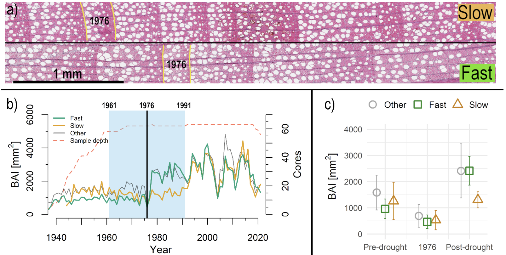
</a>

> **"Pre-drought conservative xylem hydraulic architecture is associated with enhanced recovery from the 1976 drought in European beech (Fagus sylvatica L.)"** lead by Dr. Emanuele Ziaco (JGU Mainz) has been accepted with *Plant, Cell & Environment* and can soon be found [here](https://doi.org/10.1111/pce.70691).

### June 1st, 2026: Paper accepted
<a href="../assets/temp/yue26AFM.png" class="lightbox">
    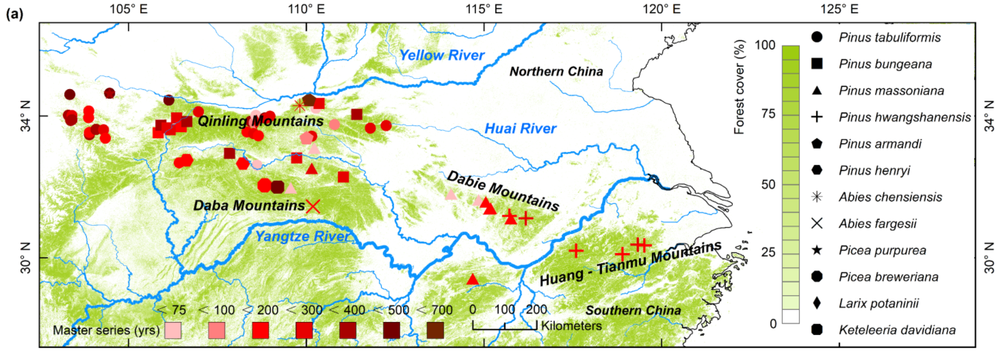
</a>

> **"Geographical and aridity gradients along with species variation shape tree growth sensitivity in the northern and southern transitional zone of China"** by Dr. Weipeng Yue (Yunnan University) and others has been published with *Agricultural and Forest Meteorology* and will be found [here](https://doi.org/10.1016/j.agrformet.2026.111286).

### May 19th, 2026: Manuscript published
<a href="../assets/temp/kunz26JGR.png" class="lightbox">
    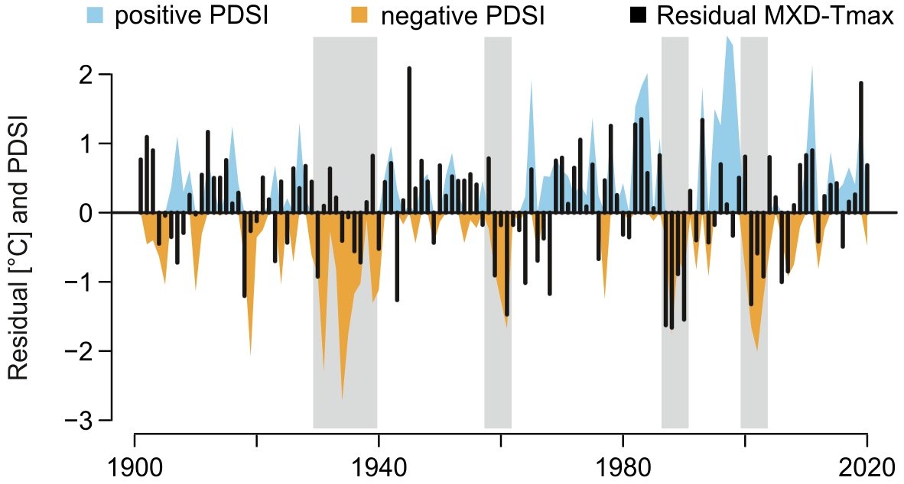
</a>

> **"Exorcizing divergence in tree-ring density along the Rocky Mountains"** by Marcel Kunz (JGU Mainz) and others has been published with *Journal of Geophysical Research: Biogeosciences* and is available [here](https://agupubs.onlinelibrary.wiley.com/doi/10.1029/2026JG009783).

### April 17th, 2026: Manuscript published
<a href="../assets/temp/esper26DENDRO.jpg" class="lightbox">
    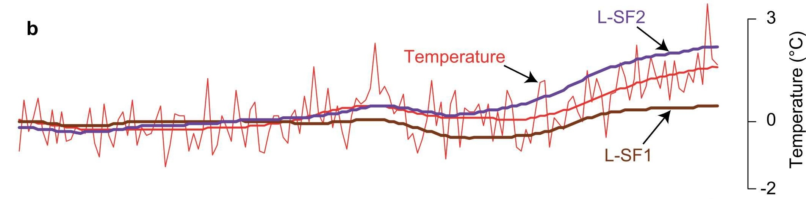
</a>

> **"Warming-induced positive age trends challenge MXD detrending"** by Professor Jan Esper (JGU Mainz) and Professor Ulf Büntgen (University of Cambridge) has been accepted for publication with *Dendrochronologia* and is now in press [here](https://www.sciencedirect.com/science/article/pii/S1125786526000615).

### April 14th, 2026: Pre-print available
> Yuxin Liu and Professor Feng Chen's (Yunnan University) manuscript entitled **"Coupled atmospheric and land–atmosphere effects on long-term streamflow of the Liao River in East Asian Monsoon Margin"** is now available as a pre-print through *SSRN* [here](https://papers.ssrn.com/sol3/papers.cfm?abstract_id=6561250&__cf_chl_tk=ymQTMB..qP0HNiGi82n_NzHvp69gJGiN6fymFwd1Mjc-1776205069-1.0.1.1-eaYlr31tWVA0xfIqjrnRCaxe.tMndwGJd_b9dhWiZmI).

### February 9th, 2026: Paper published
<a href="../assets/temp/chen26pnas.png" class="lightbox">
    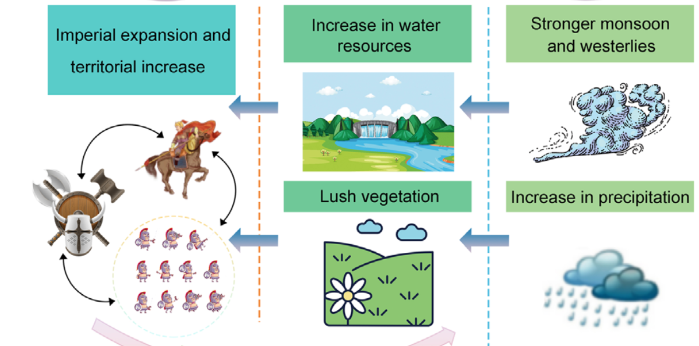
</a>

> Professor Feng Chen's (Yunnan University) paper entitled **"Climate-driven reduction in biomass production of the Eurasian steppe coincides with nomadic migration during the first millennium CE"** has been published in the journal *Proceedings of the National Academy of Sciences* and is available [here](https://www.pnas.org/doi/10.1073/pnas.2513573123).

### January 12th, 2026: Paper published
<a href="../assets/temp/bra26CtP.png" class="lightbox">
    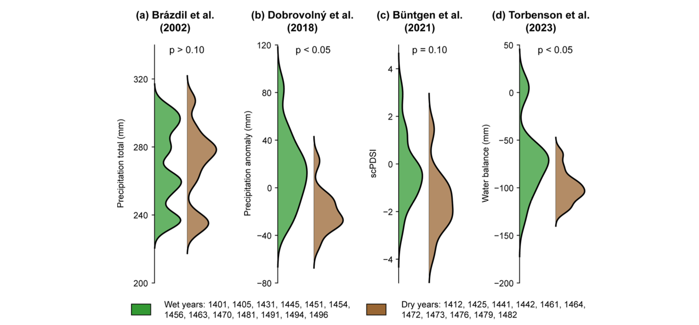
</a>

> Professor Rudolf Brázdil's (Masaryk University) paper entitled **"15th century climate in the Czech Lands and its Central European context"** has been published in the journal *Climate of the Past* and can be found [here](https://cp.copernicus.org/articles/22/49/2026/).

### January 9th, 2026: Paper published
<a href="../assets/temp/chen26npj.png" class="lightbox">
    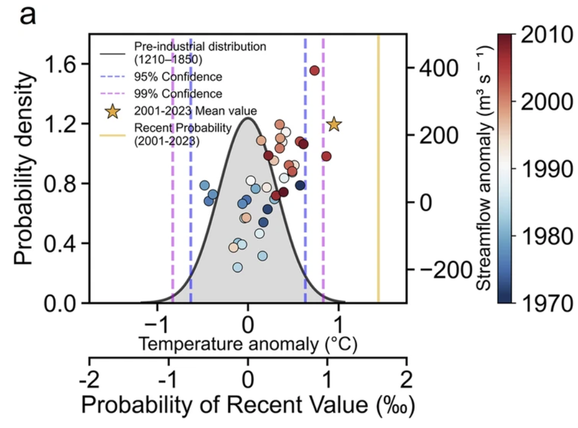
</a>

> A paper lead by Dr. Youping Chen (Yunnan University), entitled **"Unprecedented recent summer warming and cross-sphere hydrological coupling in Asian Water Towers"**, is now published with *npj Climate and Atmospheric Science* (accessible [here](https://www.nature.com/articles/s41612-025-01254-y)).

### January 3rd, 2026: Paper published
<a href="../assets/temp/yue26AGUA.png" class="lightbox">
    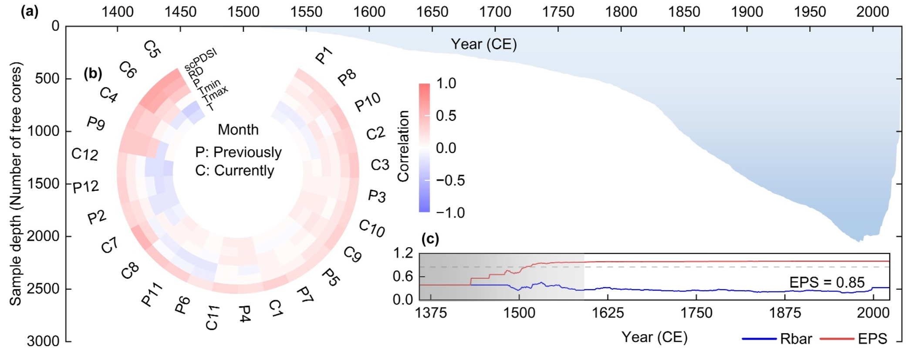
</a>

> A paper lead by Weipeng Yue and Professor Feng Chen (Yunnan University), entitled **"Runoff Reconstructions and Future Projections Indicate Highly Variable Water Supply From Pacific Rim Water Towers"**, is now published with *AGU Advances* (accessible [here](https://agupubs.onlinelibrary.wiley.com/doi/10.1029/2025AV002053)).

### November 20th, 2025: Paper published
<a href="../assets/temp/wang25CEE.png" class="lightbox">
    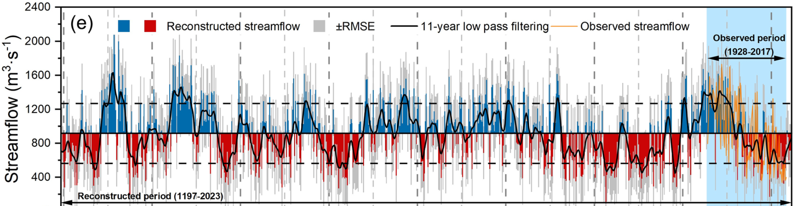
</a>

> A paper lead by Shijie Wang and Professor Feng Chen (Yunnan University), entitled **"Recent south-central Andes water crisis driven by Antarctic amplification is unprecedented over the last eight centuries"**, is now published with *Communications Earth & Environment* (accessible [here](https://www.nature.com/articles/s43247-025-02858-1/)).

### October 13th, 2025: Paper published
<a href="../assets/temp/esper25DENDRO.png" class="lightbox">
    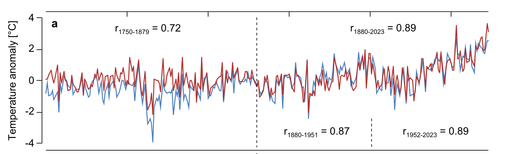
</a>

> **"Pan-alpine summer temperatures since 742 CE"** by Professor Jan Esper (JGU Mainz) and others has been [published](https://www.sciencedirect.com/science/article/pii/S1125786525001468) in *Dendrochronologia*.

  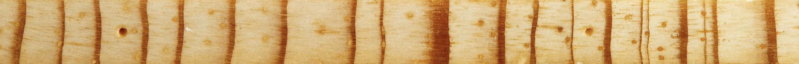

